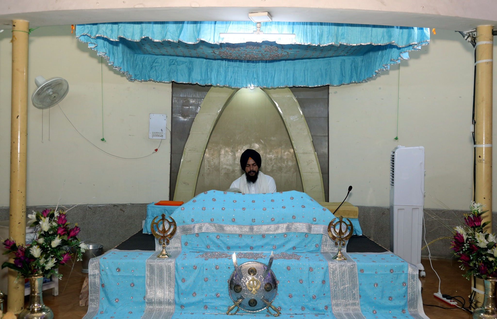

# Day 1
1. 8:30am to 9:30am
      * In gurudwara sahib we took the blessings from god for our secure future.  
        
2. 9:30am to 10:00am:
      * Guru ka Langar

3. 10:30am:
      * Settled in auditorium and after that digniteries  delivered the speech on different topics.

4. From 1:00pm to 2:00pm:
      * There is a lunch break.

5. At 2:00pm:
      * Our assigned Mentors took us to our classes to give briefing about our branches in the classrooms.  After that we got off from the college and persued towards our home.
  

        

# Day 2
1. 9:30am to 10:30am
      * We gave the english proficiency test in the mechanical seminar hall of college and it was great.

2. 10:30am to 11:30am:
      * We gave the Maths proficiency test in the mechanical seminar hall of college and it was okay okay.

3. 11:30am to 1:00pm:
      * After the test there is a break in which we explored the campus and met our seniors and got to know more about the campus. 

4. From 1:00pm to 2:00pm:
      * There is a lecture based on "How food plays an pivotal role  in our daily life" by the food department officer from PAU University.

5. At 2:00pm to 3:00pm:
      * After that there is a informative lecture about our college academic website and other information and at last we started dispersing from college.
  

# Day 3

1. Lecture by DR. Jaswinder singh (9:00am to 11:00am)
      * Day started with another pleasant morning and we went to college auditorium to attend the lecture which was delivered by DR. jaswinder singh as he is
        a very good teacher of science and mathematics and tries his best to teach students in very simple way and by providing them intresting and real life
        examples. He is mainly famous for his lab on four wheels which he had created in his car, which was a great idea. At the end the trustee member of
        Nankana sahib education trust had arrived and given him respect by the official GNDEC award.  
        

2. Lecture by universal human values teacher on "Is success only suficient to be happy in life" (11:00am to 1:00pm)
      * The teacher started the lecture and explains us everything about the topic with the help of presentation. There are some doubts of the students which
        they have asked to the teacher and she clearly resolve their doubts in a simple and intresting way. At the end she ended the lecture by a quote
        which was "Sucsess is not key to happiness, Happiness is the key to success", after that we started moving to homes.    
        

