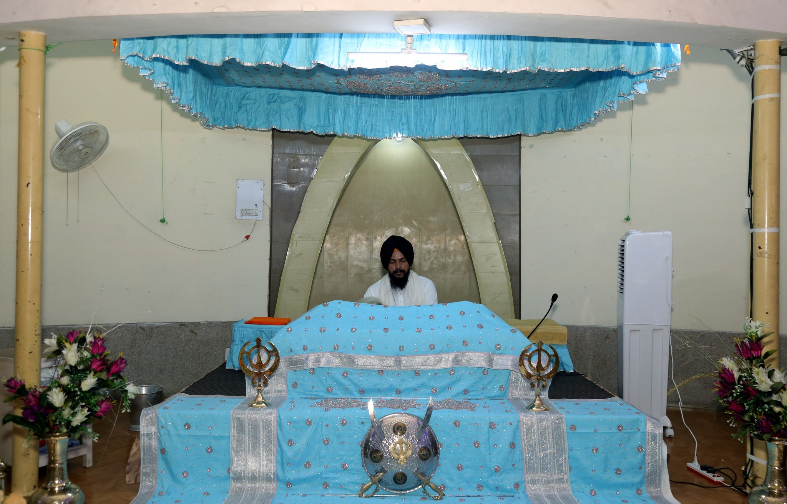

# Day 1
1. 8:30am to 9:30am
      * In gurudwara sahib we took the blessings from god for our secure future.  
        
2. 9:30am to 10:00am:
      * Guru ka Langar

3. 10:30am:
      * Settled in auditorium and after that digniteries  delivered the speech on different topics.

4. From 1:00pm to 2:00pm:
      * There is a lunch break.

5. At 2:00pm:
      * Our assigned Mentors took us to our classes to give briefing about our branches in the classrooms.  After that we got off from the college and persued towards our home.
  

        

# Day 2
1. 9:30am to 10:30am
      * We gave the english proficiency test in the mechanical seminar hall of college and it was great.

2. 10:30am to 11:30am:
      * We gave the Maths proficiency test in the mechanical seminar hall of college and it was okay okay.

3. 11:30am to 1:00pm:
      * After the test there is a break in which we explored the campus and met our seniors and got to know more about the campus. 

4. From 1:00pm to 2:00pm:
      * There is a lecture based on "How food plays an pivotal role  in our daily life" by the food department officer from PAU University.

5. At 2:00pm to 3:00pm:
      * After that there is a informative lecture about our college academic website and other information and at last we started dispersing from college.
  

# Day 3

1. Lecture by DR. Jaswinder singh (9:00am to 11:00am)
      * Day started with another pleasant morning and we went to college auditorium to attend the lecture which was delivered by DR. jaswinder singh as he is
        a very good teacher of science and mathematics and tries his best to teach students in very simple way and by providing them intresting and real life
        examples. He is mainly famous for his lab on four wheels which he had created in his car, which was a great idea. At the end the trustee member of
        Nankana sahib education trust had arrived and given him respect by the official GNDEC award.  
        

2. Lecture by Dr. Priya darshini mam on "Universal human values" (11:00am to 1:00pm)
      * The teacher started the lecture and explains us everything about the topic with the help of presentation. There are some doubts of the students which
        they have asked to the teacher and she clearly resolve their doubts in a simple and intresting way. At the end she ended the lecture by a quote
        which was "Sucsess is not key to happiness, Happiness is the key to success", after that we started moving to homes.    
        

# Day 4

1. English lecture by prof. Asthik sharma (9:30am to 10:30am)
      * I started the day with god blessings and procedded to our classroom. My lecture was in
             mechanical seminar hall, teacher entered the classroom and sir gave his introduction and
             asked us few basic questions to check our english level, Basicaly today's lecture is an
             introductory lecture.
2. Chemistry lecture by prof. Karan bhalla (10:30am to 11:30am)
      * After the english lecture prof. Karan bhalla sir arrived in our classroom and gave us their
           introduction and we also did the same. Sir told about how the curriculum and examination system works in campus. I really enjoyed their class as it was one on one interaction with sir.

3. Lecture by Dr. Priya darshini mam (12:30pm to 2:30pm)
      * She tells us about how to make happiness continuous in life and tells us the difference between happiness and excitment.
              She also tells us not to take your decisions by pre-conditioning and several other things that make our happiness continuous.

         

4. Causmic club session by students (2:30pm to 3:30pm)
      * Students performed on the stage by singing songs and other performances like shayari, songs, etc. After that two students came
           on stage and gave information about laptop, which laptop is best for IT and computer science students. They gave a brief information
           about all the parts of laptop and on which part you should focus according to your need, after that they concluded the session.

# Day 5

1. P2P Lecture (9:30am to 10:30am)
      * Our senior students took this lecture which is about computer programming language C++. They started with the basic introduction
              with C++ language and tells us various other things about the language for ex: data types, string, variable etc.
           

   
2. Basic electronics and electrical engineering lecture by Prof. Simranjeet kaur (10:30am to 11:30am)
   * First of all when mam entered the class she gave us their introduction and after that we started giving our introduction.
              Then she gave us the information about BEEE syllabus and also tells us about the books and at last she took the attendance.
     
3. Physics class (11:30am to 12:30pm)
   * Actually it was our maths class but it got cancelled due to some reason and physics teacher took our class. First of all she took
              our attendance and then she asked some questions about physics and gave us information about some basic tools like vernier and
              screw gauge. In last 15 minutes we had a great fun by coming and entertaining on stage and at end all classes are over and we
              headed towards home.

# Day 6

1. Maths lecture by prof. Sukhminder singh (9:30am to 10:30am)
      * I started the day with god blessings and procedded to our classroom. My lecture was in
        mechanical seminar hall, teacher entered the classroom and sir gave us their is a intresting and unique, he given us tasks like
        first task to find the maths syllabus from college website and second task was to find his profile from the same and i successfully
        found it. After that he told us about some mathematics mobile applications for different purposes. My first lecture was very intresting and enjoyable.
        
2. BEEE lecture by prof. Simranjeet kaur (10:30am to 11:30am)
      * Actually this class was taken by our senior students as mam has some urgent piece of work. Students taught us c++ programming
        language and gave us an activity, after completing it class was concluded.

3. Lecture by Sr. Gurcharan singh (12:30pm to 1:30pm)
      * Sr.Gurcharan singh is trustee member of Nankana sahib public school and he tells about himself that how he was in study and which
        college he had joined. He also talked with all students about how was college and about the facilities students were receiving.
        
4. Lecture by CLM incharge  (1:30pm to 3:30pm)
      * He tells about the CLM club in which they organise several events to enhance our skills and to achieve new skills. He also tells us
        about website on which several courses are available which will be added in our resume at the end of our degree. At the end he encourages us to participate in courses to achieve maximum certificates and lecture ended.

        # Day 7

1. Lecture by sports complex head of college (9:30am to 10:30am)
      * As regularly started day with blessings of god and we settled in auditorium and resided Mool mantar, after that sir started giving
        information about college physical activities and how to participate in that. He also told us about the facilities that college 
        provides to students for sports.
        
2. Lecture by head of Digital marketing club (10:30am to 11:30am)
      * Sir taught us about the club that how it promotes the campus by updating social media pages daily. Sir givem all the information about
        the club and also about the activities that their team organise in a month. This year some of students from his team got passed out
        from the campus and he gave us the oppurtunity to join their team by registering and giving interview to their team members.
        
3. Lecture by Dr.Randhir singh (11:30am to 12:30pm)
      * Randhir sir gave us all the information about how the examinations are conducted in the campus in a transparent way as it is an
        autonomous college, sir also told us about the reclearing the exams and the attendace criteria to appear in examination and how to
        access the academic portal of college and all the features in that academic portal.
        
4. P2P class by our seniors (1:30pm to 2:30pm)
      * This class was about learning c++ programming language in which we are provided with tasks about coding and we performed it very
        well and also got checked by the senior.

5. Chemistry lecture by Prof. Karan bhalla (2:30pm to 3:30pm)
      *  Sir taken our class in very intresting manner. He started the class by providing us the blueprint of the syllabus and after that
         sir started with the 1st chapter of chemistry that is water chemistry and taught us 3-4 topics about that chapter and ended the session.

                  
            
 # Day 8

1. BEEE class by prof.Simranjeet kaur (9:00am to 10:30am)
      * Mam started the lecture by basic introduction to electrical and basic fundamentals of it. I had written some notes and she also gave us numericals to solve for each topic.
        It was a very great lecture by the mam.
        
        
2. Lecture by Prof.Jaswant singh (10:30am to 12:00pm)
      * Sir told us about how the IT branch works and gave us brief description about it. He asked us several questions to clear our vision and also give information about different
        programming languages and also about their uses for diffenent task. Also told us about the Artifiical intelligence.

3. Musical chair activity by E Cell club (2:30pm to 4:00pm)
      * We played musical chairs in the mechanical seminar hall and we enjoyed it a lot. There are three rounds in the game and we played it very well and my friend stood first in this game.
        

 # Day 9
        
1. Maths class by Pragya mam (9:30am to 10:30am)
      * Mam started with the introduction as she is new to us and its her first lecture in our class and we enjoyed a lot in this class.
        She started with the basic introduction of first chapter in first unit that is partial differentiation.
         
2. Chemistry class by Amanpreet kaur sodhi mam (10:30am to 11:30pm)
      * Mam gave us their introduction as this was our first interaction in college and she told us very important things about college and
        different subjects to perform very well in all the subjects and to achieve great marks. She also gave brief description for chemistry
        syllabus.

3. BEEE class by prof.Simranjeet kaur (12:30pm to 1:30pm)
      * Mam started the lecture by basic definitions of electrical and basic fundamentals of it. I had written some notes. It was a very great lecture by the mam.
  
4. English class by Parneet kaur mam (1:30pm to 2:30pm)
      * This lecture was also mostly of introuctry lecture as it was our first interaction with mam. Mam asked us about our hobbies, strengths,
        weakness, etc and also gave us activities to do in class. One from those is to write three lines about your skill in which 2 lines were
        truth and 1 was lie. That was a great lecture by mam.

 # Day 10

1. BEEE class by prof.Simranjeet kaur (8:30am to 9:30am)
     * Mam started the lecture by basic derications of electrical and basic fundamentals of it. I had written some notes and she also gave
       us numericals to solve for each topic. It was a very great lecture by the mam.

2. Maths class by Pragya mam (9:30am to 10:30am)
      * Mam gave us different questions about topic that we started yesterday and today we did some new variety of questions as they were
         very challenging and brain storming.

3. PPS class by Sunil saharan sir (10:30am to 12:30pm)
   * Actually in this class there is adjustment of sir as teachers are not alloted for PPS classes but we enjoyed a lot in this class because sir has a very unique personality and his laughing style is very cute and impressive as he can easily can be the reason of someones's laughter.
  

 4. Chemistry class by Amanpreet kaur mam (1:30pm to 2:30pm)
     * Today mam started with the first chapter of chemistry that is water chemistry and we came to know about it very curiously about 
       hardness and softness of water.

5. BEEE class by Simranjeet kaur (2:30pm to 3:30pm)
    * In this class mam gave us 4 numericals to solve from which some are moderate and some are little brain challenging but we loved to solve
      it as it was very fun.

 # Day 11

1. PPS class by Sunil saharan sir (8:30am to 10:30am)
     * Today we met again with sir and had a great class with sir and today sir told us about lab files and our first topic is conversation
        and dialogue and we also written a conversation between two friends about and also asked about favourite or worst moment in our life.
       
2. Chemistry lab class by Mandeep mam (10:30am to 12:30pm)
      * Mam started with the basic experiment and told us about all the glass operatus needed to perfrom that experiment and gave a brief
        description about it also told us all the definitions and calculations about that experiment and a brief description about lab marks.
        
3. Mentoring class by mentor: Randeep kaur (1:30pm to 2:30pm)
   * This was our first mentoring class and first interaction with mam also. This is not a class like other subject classes as it is a fun class in which fun activities are done and skills of personality development are told. Mam started with the introduction of students and told
     us about second activity that we are going to perform next week.
  

 4. English class by Parneet kaur mam (2:30pm to 3:30pm)
     * In the last lecture mam gave us a homework to read the first page of novel The Bell Jar 10 times and we are going to read it in the next lecture and today was that day and we all performed well in this activity. This activity is full of fun and encourage us to learn.
       

  5. BEEE class by Simranjeet kaur (2:30pm to 3:30pm)
    * In this class mam gave us 4 numericals to solve from which some are moderate and some are little brain challenging but we loved to solve
      it as it was very fun.

 # Day 12

   1. BEEE class by Simranjeet kaur mam (9:30am to 10:30am)
      * Today mam proceded the chapter of electricals with important derivations and definitions and introduced us some important
        concepts about electricity. 
       
   2. English lab (10:30am to 12:30pm)
      * Actually it was a free class as mam was not absent and in this class we talked to our classmates and made a good interaction with
        them and started to know them.
        
   3. Chemistry class by Amanpreet kaur mam (1:30pm to 2:30pm)
      * In this lecture mam gave us assignment to prepare and to submit it next month. She told us how to prepare that assignment about
       what will be the main headings and their decriptions. Mam made different groups and each group had given a particular topic to make
       assignment and after that mam continued with the syllabus.
  

   4. English class by Parneet kaur mam (2:30pm to 3:30pm)
       * In the lecture mam told us to present our homework to her as it was to read 10 lines of a novel of your choice in clear and
         crisp voice in english and after that she also gave us feedback about our reading skills.

 # Day 13
        
1. Maths class by Pragya mam (9:30am to 10:30am)
      * Mam continued with the syllabus and gave us several questions to solve.
         
2. Chemistry class by Raman mam (10:30am to 11:30pm)
      * Actually our chemistry teacher got changed and in this lecture it was our first interaction and we introduced ourself to teacher and after she
        continued with the first chapter of chemistry that is water chemistry. 

3. BEEE class by prof.Simranjeet kaur (12:30pm to 1:30pm)
      * Mam started the lecture with the second chapter AC fundamentals. I had written some notes. It was a very great lecture by the mam.
  

  # Day 14

1. BEEE class by prof.Simranjeet kaur (8:30am to 9:30am)
     * Mam started the lecture by basic derications of AC fundamentals. I had written some notes and she also gave
       us numericals to solve for each topic. It was a very great lecture by the mam.

2. Maths class by Pragya mam (9:30am to 10:30am)
      * Mam gave us different questions about topic that we started yesterday and today we did some new variety of questions as they were
         very challenging and brain storming.

3. PPS class by Sunil saharan sir (10:30am to 12:30pm)
   * In this class mam taught about computer with the help of powerpoint presentation. She gave us all the basic knowledge about computer and also taught us
     how it works.
  

 4. Chemistry class by Raman mam (1:30pm to 2:30pm)
     * Today mam started with the next topic of the first chapter that is how the hardness of water can be removed and some experiments about this process.

5. BEEE class by Simranjeet kaur (2:30pm to 3:30pm)
    * In this class mam gave us numericals to solve from which some are moderate and some are little brain challenging but we loved to solve
      it as it was very fun.

 # Day 15

1. PPS class by Sunil saharan sir (8:30am to 10:30am)
     * Today mam gave us all information about input and output devices that are ofently used in computer systems and gave us a brief description about them.
       
2. Chemistry lab class by Mandeep mam (10:30am to 12:30pm)
      * Today mam gave us instructions that how to perform an experiment and our first experiment was to check total hardness of water. After listening to all
        the instructions we proceded to perform the experiment and got the accurate readings. 
        
3. Mentoring class by mentor: Randeep kaur (1:30pm to 2:30pm)
   * Today we played a game in class which was we have to pick up a slip from the box and a word is written on it and we have to speak on it for 1-2 minutees. 
  

 4. English class by Parneet kaur mam (2:30pm to 3:30pm)
     * Today mam gave us an assignment to write a conversation between a client and an employee and gave us different words which are necesarry to use in
        conversation.

 # Day 16

   1. BEEE class by Simranjeet kaur mam (9:30am to 10:30am)
      * Today mam proceded the chapter of AC fundamentals with important derivations and definitions and introduced us some important
        concepts about AC circuit. 
       
   2. English lab by Manpreet mam (10:30am to 12:30pm)
      * Today it was our first interaction with our teacher and it was great. Mam introduced herself to us we did the same to mam. Mam is very friendly
        in nature.
        
   3. Chemistry class by Raman mam (1:30pm to 2:30pm)
      * In this lecture mam proceded with the next topic of water chemistry that is how to soften the hard water or how to convert hard water into soft water.
  

   4. English class by Parneet kaur mam (2:30pm to 3:30pm)
       * in this lecture i went to give NSS interview to get selected.

   # Day 17

   1. Maths class by pragya mam (9:30am to 10:30am)
      * Today mam introduced some new concepts of homogenous functions and we practised several questions of them.
       
   2. English class by parneet mam (10:30am to 11:30am)
      * In this lecture mam given us an email to write which is about to apply to professor job in college of your own department. we had completed this task very
        sincerely.
        
   3. BEEE class by simranjeet mam (12:30pm to 1:30pm)
      * It was a free lecture because strength was not enough due to rain.
  

   4.  Chemistry class by Raman mam (1:30pm to 2:30pm)
       * Mam procedded with the further topics which was softening of hard water by soda lime process.

   5. Maths tutorial class by Pragya mam (2:30pm to 3:30pm)
       * In this lecture mam gave us questions to about which was about the previous topic we had done with.

# Day 18

1. BEEE class by prof.Simranjeet kaur (8:30am to 9:30am)
     * In this lecture we did some definitions and proofs and after that we further proceded towards numericals related to the topics that we had done recently.

2. Maths class by Pragya mam (9:30am to 10:30am)
      * Mam gave us variety of questions related to homogenous functions and we did all of them.

3. PPS class by Sunil saharan sir (10:30am to 12:30pm)
   * In this lecture we studied about different types of softwares that helps the computer to run and some other softwares which plays a vital role in the
     computer systems.
  

 4. Chemistry class by Amanpreet kaur mam (1:30pm to 2:30pm)
     * In this class mam proceded with the further topics of chapter like boiler feed water, priming, sludge, scale, etc.

5. BEEE class by Simranjeet kaur (2:30pm to 3:30pm)
    * In this lecture we went to auditorium for an interaction with sir and he gave us information about our carrier.

 # Day 19

1. PPS class by Sunil saharan sir (8:30am to 10:30am)
     * It was a free lecture and in free timw i explored micrsoft visual studio code.
       
2. Chemistry lab class by Mandeep mam (10:30am to 12:30pm)
      * Today mam gave us instructions that how to perform an experiment and our second experiment was to check the amount of chlorine content present in water. After listening to all
        the instructions we proceded to perform the experiment and got the accurate readings. 
        
3. Mentoring class by mentor: Randeep kaur (1:30pm to 2:30pm)
   * we had done aptitude questions which will help us in final year placements.
  

 4. English class by Parneet kaur mam (2:30pm to 3:30pm)
     * Today mam started with the first unit which was about communication and mam gave us a brief description about topics of that unit.    

 # Day 20

   1. BEEE class by Simranjeet kaur mam (9:30am to 10:30am)
      * Today mam proceded with important derivations of resistor, inductor and capacitor and also gave us a brief description about them. 
       
   2. English lab (10:30am to 12:30pm)
      * In this class mam continued with the introduction of students that were left or absent in the last class and also gave us an assignment to make.

        
   3. Chemistry class by Raman mam (1:30pm to 2:30pm)
      * Today mam proceded further with the topics of the chapter and gave us a task before starting and that task was to read topics and teach them to the
        students as well as to mam, which is a very fun creative activity. 
  

   4. English class by Parneet kaur mam (2:30pm to 3:30pm)
       * In the lecture mam gave us an assignment to write about what type of communicator you are? and also taken our doubts about assignment and started with
         topics of the chapter.
